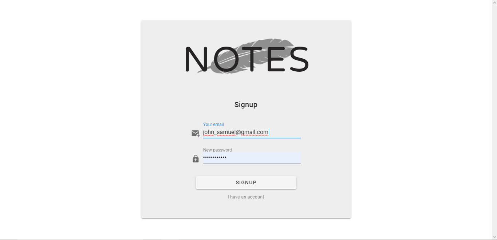
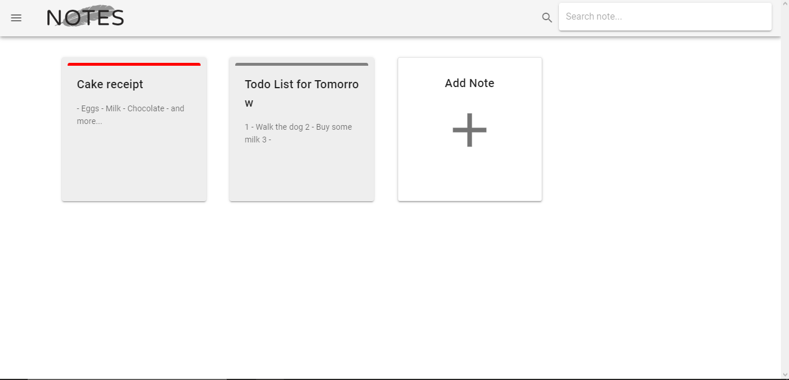
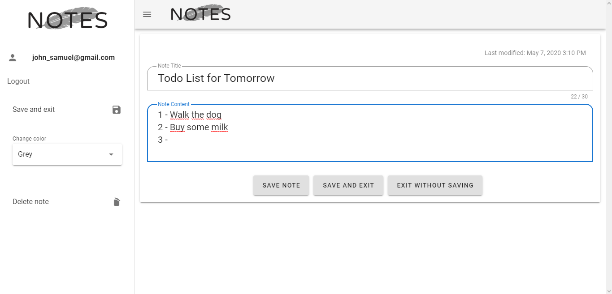
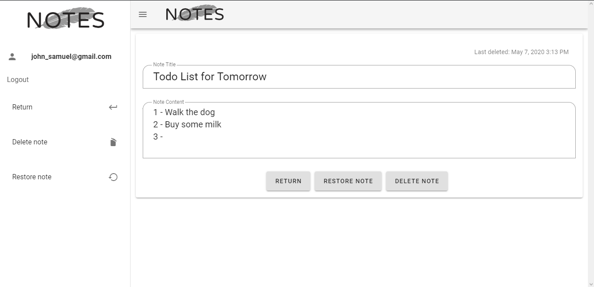
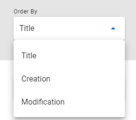
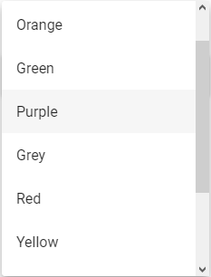
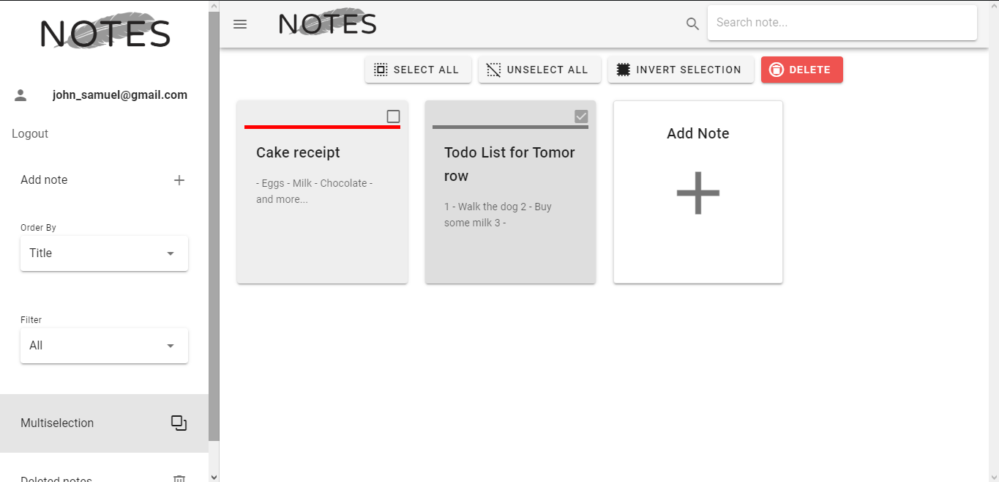

# Notes

> A web application for creating, editting and deleting personal notes.

## Technologies

- Vue
  - Vue CLI 3
  - Vuetify
  - Vue Router
  - Vuex
- npm
  - uuid
  - moment
- Firebase
  - Firestore
  - Hosting
  - Authentication

## Index

- [Description](#description)
- [How to use](#how-to-use)
  - [Hosted application](#hosted-application)
  - [Local repository](#local-repository)
- [License](#license)
- [About](#about)

## Description

This is an application which imitates a personal annotation manager, giving the user the ability to create, edit and delete notes.
Every note is saved on firebase firestore, and each user must have an account to use this application. The signup is simple and with an
account, users´ notes will be safe and accessible from any device, from anywhere, whenever needed.

[Back to top](#notes)  
[Back to index](#index)

## How to use

There are two ways of using this application: in the hosted app and in the local development repository

### Hosted application

First, go to this <a href="https://notes-5cf6a.firebaseapp.com">link</a> to access the application hosted on firebase.
Then, follow the steps below:

1. Register
  
All users must register before using Notes. To do so, just enter with your account email and password on the login screen.
  If you don´t have one, click on the 'I don´t have an account' link and signup.

  
  
  
  

  
2. Homepage
  
After registered, the user will be redirected to the homepage. Here, the user can do most of the functionalities of the app, such     as creating a new note by clicking on the giant 'Add note' card button or by selecting this option on the sidebar menu on the left, as   well as edit an already created note by simply clicking in it.

  
  
  
  
  
  

  
3. Notes deleted
  
When a user deletes a note, it goes to the trash. There, the user can restore notes deleted or remove them permanently. There is     also the possibility to read deleted notes, but not to edit them (must restore them first).

  
  
  
  

  
4. Additional functionalities
  
Apart from the primary functionalities of the app, there are secondary ones which can improve the user experience. From filters to   multiselection, notes management becomes easier and faster.

  
  - Order by
    > 
Order all notes by title, date of creation or modification

    
  
  - Filter
    > 
Filter notes by their color, which can be changed in edit screen

    
  
  - Multiselection
    > 
Multiselection enables the user to select multiple notes at once and delete them in just one click

    
  
[Back to top](#notes)  
[Back to index](#index)

### Local Repository

To use this application locally and have access to all the code, follow the steps below:

0. Make sure to have installed NodeJS on your computer
1. Clone this repository
2. Open your favorite terminal on cloned repository
3. Run ``npm install`` to install all dependencies
4. Run ``npm run serve`` to start the local server for the project

[Back to top](#notes)  
[Back to index](#index)

## License
MIT License

Copyright (c) 2020 GabrielMCavalcante

Permission is hereby granted, free of charge, to any person obtaining a copy
of this software and associated documentation files (the "Software"), to deal
in the Software without restriction, including without limitation the rights
to use, copy, modify, merge, publish, distribute, sublicense, and/or sell
copies of the Software, and to permit persons to whom the Software is
furnished to do so, subject to the following conditions:

The above copyright notice and this permission notice shall be included in all
copies or substantial portions of the Software.

THE SOFTWARE IS PROVIDED "AS IS", WITHOUT WARRANTY OF ANY KIND, EXPRESS OR
IMPLIED, INCLUDING BUT NOT LIMITED TO THE WARRANTIES OF MERCHANTABILITY,
FITNESS FOR A PARTICULAR PURPOSE AND NONINFRINGEMENT. IN NO EVENT SHALL THE
AUTHORS OR COPYRIGHT HOLDERS BE LIABLE FOR ANY CLAIM, DAMAGES OR OTHER
LIABILITY, WHETHER IN AN ACTION OF CONTRACT, TORT OR OTHERWISE, ARISING FROM,
OUT OF OR IN CONNECTION WITH THE SOFTWARE OR THE USE OR OTHER DEALINGS IN THE
SOFTWARE.

[Back to top](#notes)  
[Back to index](#index)

## About

[Back to top](#notes)  
[Back to index](#index)
