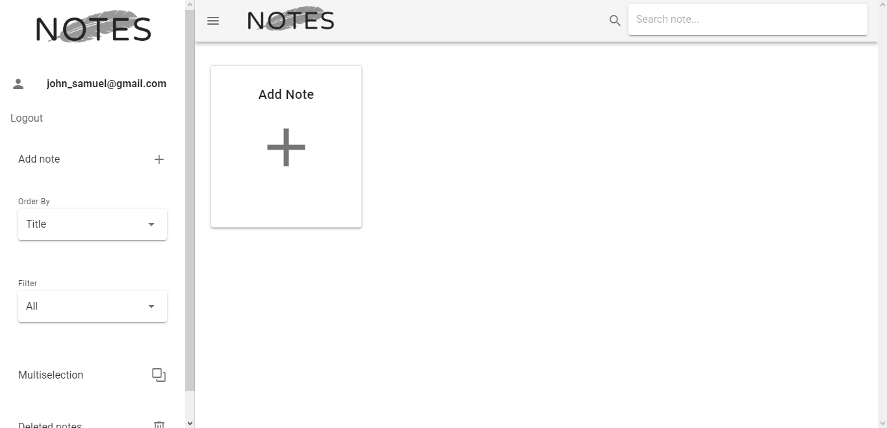
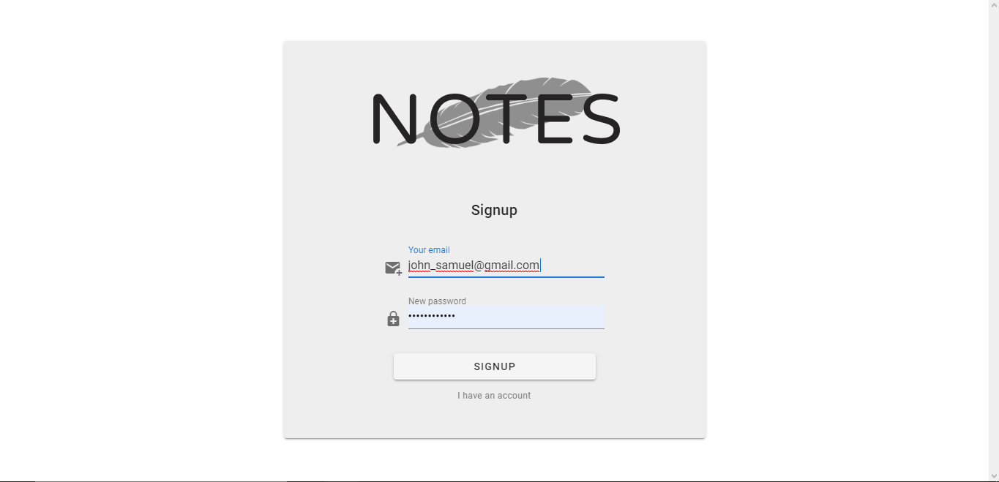
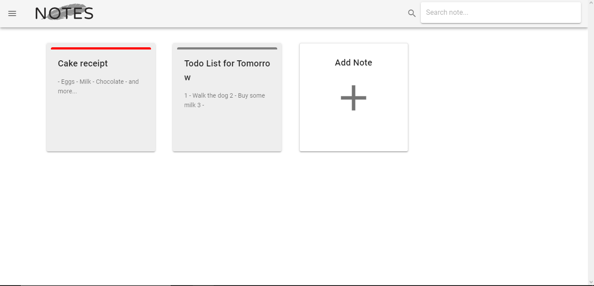
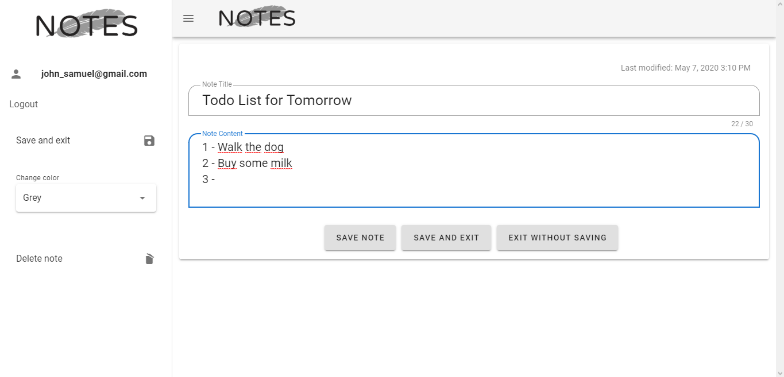
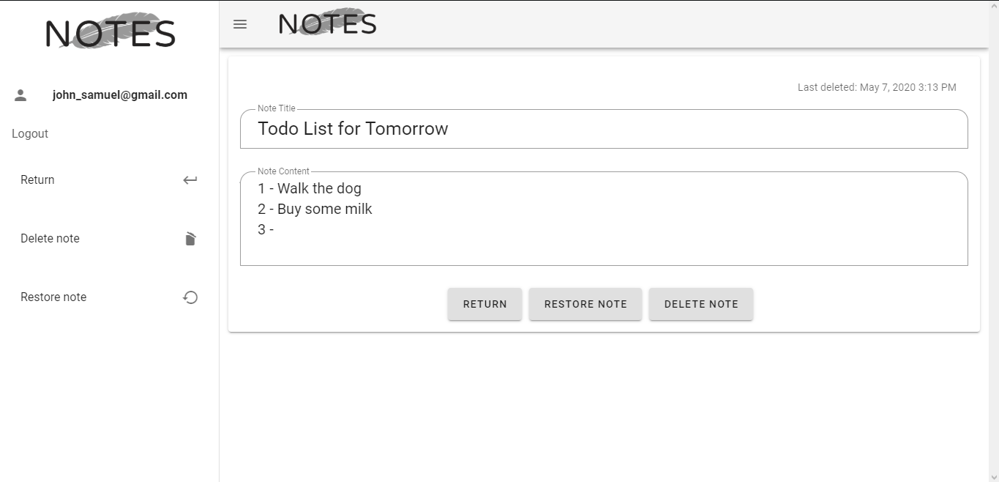
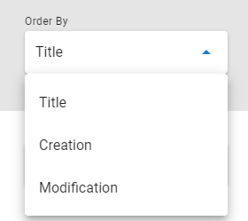
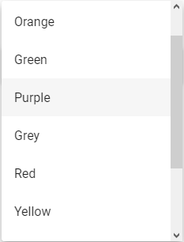
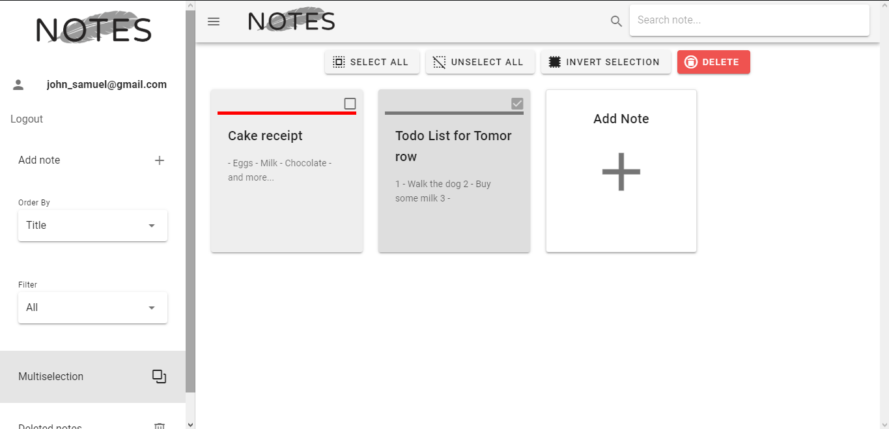

# Notes

> Um aplicativo da web para criar, editar e excluir notas pessoais.

Leia este documento em sua língua de preferência: 
- [English](README.md) 
- [Português](README.pt.md)

O Notes é um aplicativo da web que imita um gerenciador de anotações pessoais, permitindo ao usuário criar, editar e excluir notas.
Todas as notas são salvas em uma instância do Firebase Firestore e cada usuário deve ser autenticado para usar este aplicativo. Os usuários podem
criar uma conta ou se autenticar se já possuírem uma conta no aplicativo web.

## Tecnologias utilizadas

- Vue
  - Vue CLI 3
  - Vuetify
  - Vue Router
  - Vuex
- npm
  - uuid
  - moment
- Firebase
  - Firestore
  - Hosting
  - Authentication

## Sumário

- [Instalação](#instalacao)
- [Como usar](#como-usar)
- [Licença](#licenca)
- [Sobre](#sobre)

## Instalação

0. Certifique-se de ter instalado o NodeJS no seu computador
1. Clone este repositório usando git
1. Abra o terminal de sua preferência no diretório do repositório clonado
1. Execute o comando ``npm install`` para instalar todas as dependências do projeto
1. Vá para src/firebase/init.js e adicione sua configuração do Firebase Firestore (gerada pelo Firebase)
1. Execute o comando ``npm run serve`` para executar o projeto no localhost

[Voltar ao topo](#notes)  
[Voltar ao sumário](#sumario)

## Como usar

Para começar, acesse este <a href="https://notes-5cf6a.firebaseapp.com">link</a> para abrir a aplicação na web (host no Firebase)
Então, siga os passos abaixo:

1. Registro
  
Todos os usuários devem se registrar antes de usar o Notes. Para isso, basta digitar o e-mail e a senha da sua conta na tela de login.
  Se você não possui uma, clique no link 'Não tenho uma conta' e inscreva-se.

  
  
  
  

  
2. Página principal
  
Após o registro, o usuário será redirecionado para a página principal. Aqui, o usuário pode executar a maioria das funcionalidades do aplicativo, como criar uma nova nota, clicando no botão gigante 'Adicionar nota' ou selecionando esta opção no menu da barra lateral à esquerda, além de editar uma uma nota existente simplesmente clicando nela.

  
  
  
  
  
  

  
3. Notas deletads
  
Quando um usuário exclui uma nota, ela é enviada para a lixeira. Lá, o usuário pode restaurar as notas excluídas ou removê-las permanentemente. Há também a possibilidade de ler notas excluídas, mas não de editá-las (é necessário restaurá-las primeiro).

  
  
  
  

  
4. Funcionalidades adicionais
  
Além das funcionalidades principais do aplicativo, existem outras secundárias que podem melhorar a experiência do usuário. De filtros à seleção múltipla, o gerenciamento de notas se torna mais fácil e rápido.

  
  - Order by
    > 
Ordena todas as notas por título, data de criação ou modificação

    
  
  - Filter
    > 
Filtra as notas por sua cor, que podem ser alteradas na tela de edição

    
  
  - Multiselection
    > 
A seleção múltipla permite ao usuário selecionar várias notas de uma só vez e excluí-las com apenas um clique

    
  
[Voltar ao topo](#notes)  
[Voltar ao sumário](#sumario)

## Licença
MIT License

Copyright (c) 2020 GabrielMCavalcante

Permission is hereby granted, free of charge, to any person obtaining a copy
of this software and associated documentation files (the "Software"), to deal
in the Software without restriction, including without limitation the rights
to use, copy, modify, merge, publish, distribute, sublicense, and/or sell
copies of the Software, and to permit persons to whom the Software is
furnished to do so, subject to the following conditions:

The above copyright notice and this permission notice shall be included in all
copies or substantial portions of the Software.

THE SOFTWARE IS PROVIDED "AS IS", WITHOUT WARRANTY OF ANY KIND, EXPRESS OR
IMPLIED, INCLUDING BUT NOT LIMITED TO THE WARRANTIES OF MERCHANTABILITY,
FITNESS FOR A PARTICULAR PURPOSE AND NONINFRINGEMENT. IN NO EVENT SHALL THE
AUTHORS OR COPYRIGHT HOLDERS BE LIABLE FOR ANY CLAIM, DAMAGES OR OTHER
LIABILITY, WHETHER IN AN ACTION OF CONTRACT, TORT OR OTHERWISE, ARISING FROM,
OUT OF OR IN CONNECTION WITH THE SOFTWARE OR THE USE OR OTHER DEALINGS IN THE
SOFTWARE.

[Voltar ao topo](#notes)  
[Voltar ao sumário](#sumario)

## Sobre

- Github - [GabrielMCavalcante](https://github.com/GabrielMCavalcante)

- LinkedIn - [Gabriel Cavalcante](https://www.linkedin.com/in/gabriel-cavalcante-4182061a2)

[Voltar ao topo](#notes)  
[Voltar ao sumário](#sumario)
